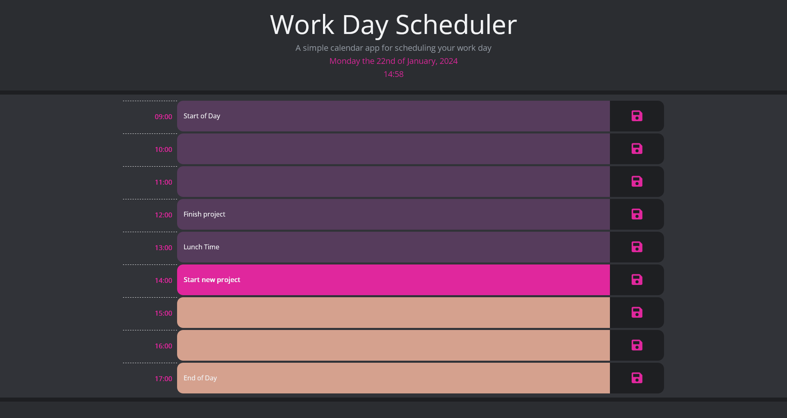

# Workday Schedule Planner

## Description

This is a daily schedule. It is intended to easily plan out your workday between the hours of 9am (09:00) and 5pm (17:00). Depending on the current time each of the time blocks will show up as different colours to distinguish between past present and future hours. Additionally todays date and the current time is presented at the top of the page and is dependent your local time.

Throughout this project I have learned how to manipulate dates using jquery and dayjs both on the webpage itself and for the logic required to change the background styles of the schedule time blocks. The most challenging part of this was initially the for loops needed to make this webpage work but the more I needed them the easier they became to use.

### The Application

This application can be found on [Github Page](https://applepieorchard.github.io/workday-planner-app/)

## Installation

N/A

## Usage

Click on any of the time blocks and write in your notes, tasks, schedules, breaks, etc, for that time block, if you want this to remain available between sessions press the save button next to the time block you wish to save. If you wish to see the webpage at different hours you can change your device's timezone. You will have to save a time block every time you make changes, including if you delete the text inside the time block.

## Credits

This application uses some components from the [getbootstrap website](https://getbootstrap.com/) but mostly it uses [jquery](https://jquery.com/) and [dayjs](https://day.js.org/) to function.

## License

This Project is subject to the [MIT License.](LICENSE)